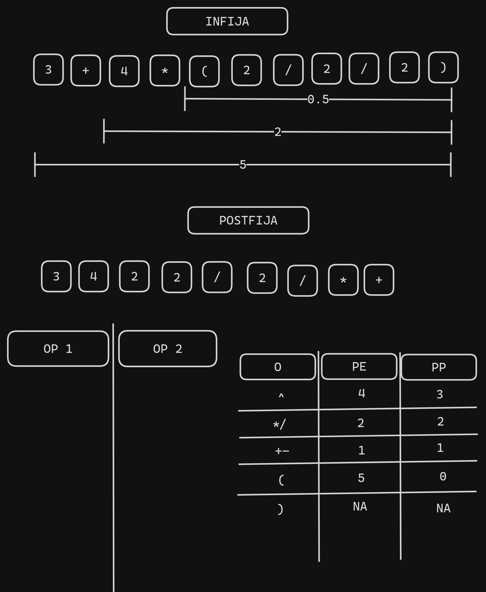
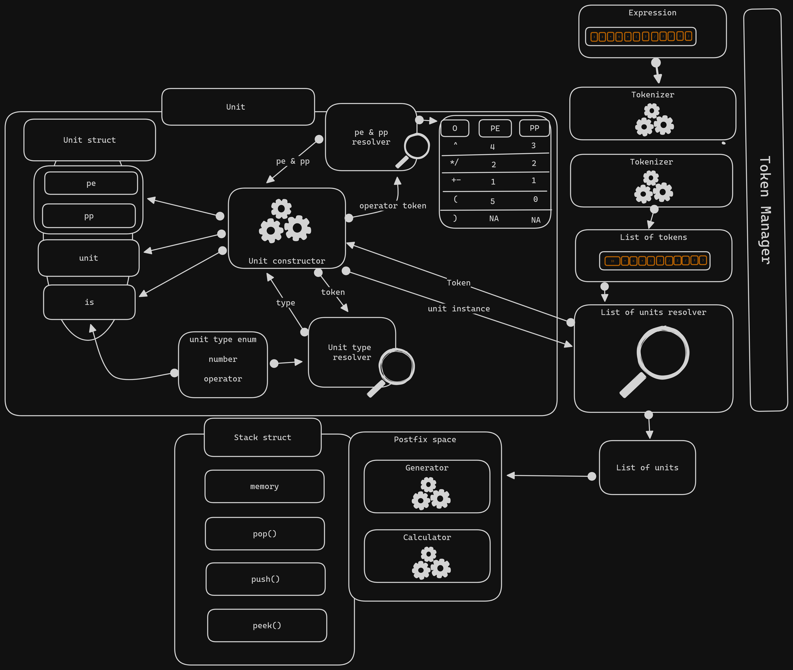

# Calculadora polaca inversa

## Entendimiento del problema

Esencialmente el problema consiste en hacer una conversion de notacion infija a postfija y luego evaluar la expresion postfija a traves de pilas.



En la imagen se observa el postfijo equivalente de la expresion infija que esta en la parte superior.

## Solucion

la solucion planteada se explica en el siguiente esquema:



El esquema consta de 3 partes esenciales:

1. Procesamiento de la expresion infija
2. Estructura de datos Unit
3. Conversion y evaluacion de la expresion postfija

### Procesamiento de la expresion infija

#### Validacion de la expresion

Es una validacion basica que se realiza para verificar que la expresion infija sea correcta. Se verifica que la expresion no contenga caracteres no permitidos y que los parentesis esten balanceados.

#### Tokenizacion de la expresion

La tokenizacion consiste en separar la expresion infija en tokens. Los tokens son los elementos que componen la expresion infija. En este caso los tokens son los numeros, los operadores, que incluyen +, -, /, *, () y ^.

La operacion anterior retorna una lista de tokens.

#### Conversion a la Estructura de datos Unit**

Es un proceso que lee cada token y los interpreta a las Estructura de datos Unit.

### Estructura de datos Unit

La estructura de datos Unit es una estructura de datos que permite almacenar los tokens de la expresion infija. Esta estructura almacena el valor del token, el tipo de token los pesos.

```go
type UnitType int

const (
 Number UnitType = iota
 Operator
)

type Ps struct {
 Pe int
 Pp int
}

type Unit struct {
 Unit string
 Ps   Ps
 Is   UnitType
}
```

Esta estructura ayuda a agilizar el proceso de conversion de la expresion infija a postfija. al instanciar cada token.

### Conversion y evaluacion de la expresion postfija

#### Conversion a postfijo

La conversion a postfijo se realiza mediante un algoritmo que funciona que dos pilas (stack de memoria y almacenamiento de postfijo) y la lista de token instanciados en Units. Los procesa uno a uno realizando las operaciones correspondientes a la conversion.

#### Evaluacion de la expresion postfija

Se procesa una nueva lista de Units generada por la conversion, se evalua cada token y se realiza la operacion correspondiente. Igualmente hace uso de un stack para los numeros.

## Descripcion del proyecto

Este proyecto consiste en una calculadora que utiliza la notacion polaca inversa para realizar las operaciones. La calculadora esta programada en go y se ha utilizado el framework de testing de go para realizar las pruebas unitarias.

La interfaz grafica esta progrmada en React.js mediante el framework Vite.js.

## Requqrimientos recomendados del proyecto

- Go 1.21
- Node.js 20
- npm 10.2

**Nota:** Se toman en cuenta que el sistema operativo es Linux, y las versiones intaladas, es posible que funcione en otros sistemas operativos y versiones.

## Instalacion

Tomando en cuanta que esta en la raiz del proyecto:

```bash
cd ./server
go install
cd ../client
npm install
```

## Ejecucion

Tomando en cuanta que esta en la raiz del proyecto:

En dos terminales distintas:

```bash
cd ./server
go run main.go
```

```bash
cd ./client
npm run dev
```

## Pruebas unitarias

El progrma cuenta con una serie de pruebas unitarias que se basan en el motor ginkgo de go, (la instalacion del cli esta documentada la web <https://onsi.github.io/ginkgo/>)

**Nota:**Si tras la instalacion de ginkgo, nose reconoce el comado ginkgo, se puede ejecutar el comando(estando en la carpeta server, y reconociendo que el sistema operativo es linux):

```bash
go env -w GO111MODULE=on
go install github.com/onsi/ginkgo/v2/ginkgo@latest
go get github.com/onsi/gomega/...

go env GOPATH # /home/user/go
export PATH=$PATH:$(go env GOPATH)/bin

ginkgo version
```

*Esto establece temporalmente las variables de entorno de go para reconocer el comando ```ginkgo```*

Tomando en cuanta que esta en la raiz del proyecto se ejecuta, para correr todas las pruebas:

```bash
cd ./server
ginkgo -r
```
